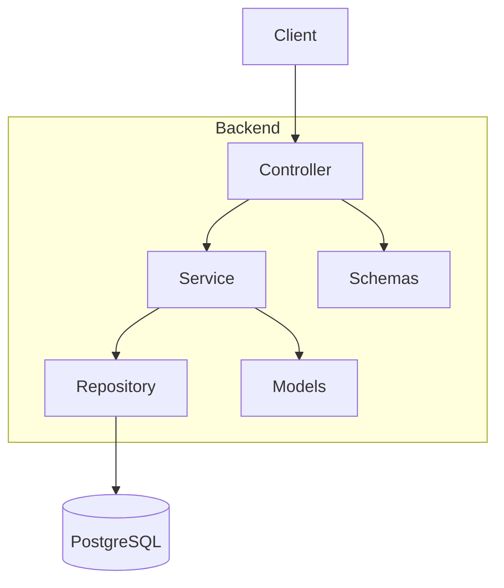

# CRM Public API

## Overview

This project is a **Customer Relationship Management (CRM) backend API** designed to manage customer data, sales opportunities, and business activities.

It follows a **clean, layered architecture** and applies best practices such as **separation of concerns, SOLID principles, and RESTful design**.

The system is built as a **Minimum Viable Product (MVP)** with a focus on scalability, maintainability, and real-world applicability.

---

## Objectives

The main goal of this project is to support a typical sales workflow:

```
Customer → Opportunity → Activity → Deal Tracking
```

It enables users to:

* Manage customers
* Track sales opportunities
* Record activities (calls, meetings, tasks)
* Maintain structured business data

---

## Tech Stack

### Backend

* **Python**
* **FastAPI**
* **SQLAlchemy (ORM)**
* **PostgreSQL**
* **Pydantic (validation)**

### Other Tools

* Pytest (testing)
* JWT Authentication
* Alembic (migrations - optional extension)

---

## Architecture

The system follows a **layered architecture pattern**:

```
Controller → Service → Repository → Database
```

### Layer Responsibilities

* **Controllers**

  * Handle HTTP requests and responses
  * No business logic

* **Services**

  * Contain business logic
  * Validate workflows and rules

* **Repositories**

  * Handle database operations (CRUD)

* **Models**

  * Represent database tables (SQLAlchemy)

* **Schemas (DTOs)**

  * Validate input/output (Pydantic)

---

## System Architecture Diagram



---

## Data Model

The system is based on four core entities:

### User

* Authentication and ownership
* One user → many opportunities & activities

### Customer

* Stores client information

### Opportunity

* Represents a sales deal
* Linked to a customer

### Activity

* Represents interactions (call, meeting, task)
* Linked to a customer or opportunity

---

## Relationships

```
User
 ├── Opportunities
 └── Activities

Customer
 ├── Opportunities
 └── Activities

Opportunity
 └── Activities
```

---

## Features

### Customer Management

* Create, read, update, delete customers

### Opportunity Management

* Create opportunities linked to customers
* Track status (Lead, Contacted, Proposal, Won, Lost)

### Activity Management

* Create activities linked to customers or opportunities
* Track interactions and follow-ups

### Authentication

* User registration and login
* JWT-based authorization
* Protected routes

---

## Security

* Each user can only access their own data
* Ownership validation enforced at service layer
* Protected endpoints via JWT authentication

---

## Testing

The project includes **integration tests** using Pytest.

### Covered scenarios:

* User authentication
* Resource ownership validation
* CRUD operations
* Access restrictions between users

---

## Project Structure

```
app/
├── controllers/
├── services/
├── repositories/
├── models/
├── schemas/
├── enums/
├── core/
└── db/
```

---

## API Endpoints (Summary)

### Customers

* `POST /customers`
* `GET /customers`
* `GET /customers/{id}`
* `PUT /customers/{id}`
* `DELETE /customers/{id}`

### Opportunities

* `POST /opportunities`
* `GET /opportunities`
* `PUT /opportunities/{id}`
* `DELETE /opportunities/{id}`

### Activities

* `POST /activities`
* `GET /activities`
* `PUT /activities/{id}`
* `DELETE /activities/{id}`

---

## How to Run Locally

### 1. Clone the repository

```bash
git clone <your-repo-url>
cd CRM
```

### 2. Create virtual environment

```bash
python -m venv venv
venv\Scripts\activate   # Windows
```

### 3. Install dependencies

```bash
pip install -r requirements.txt
```

### 4. Configure environment variables

Create a `.env` file:

```env
DATABASE_URL=your_database_url
SECRET_KEY=your_secret_key
ALGORITHM=HS256
```

### 5. Run the server

```bash
uvicorn app.main:app --reload
```

### 6. Access API docs

```
http://localhost:8000/docs
```

---

## Future Improvements

* Role-based access control (RBAC)
* Notifications and reminders
* Reporting and analytics
* Frontend integration (React)
* Dockerization and deployment

---

## Conclusion

This project demonstrates:

* Clean backend architecture
* Real-world business logic implementation
* Secure multi-user system
* Test-driven development practices

It is designed as both:

* A functional CRM MVP
* A professional backend portfolio project

---
